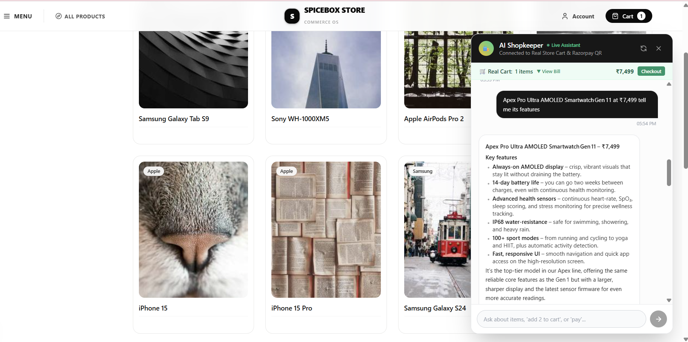
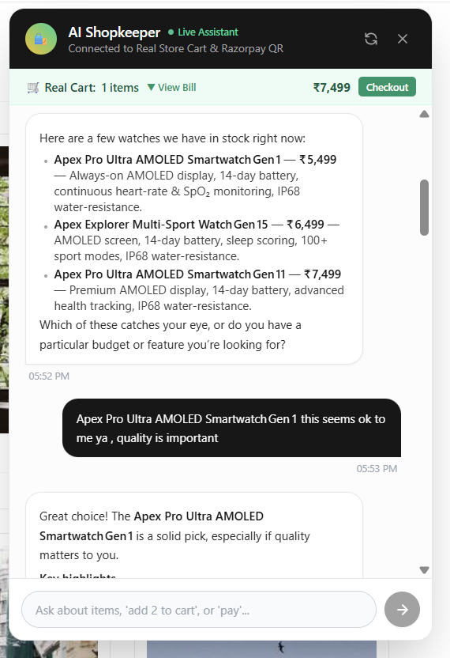
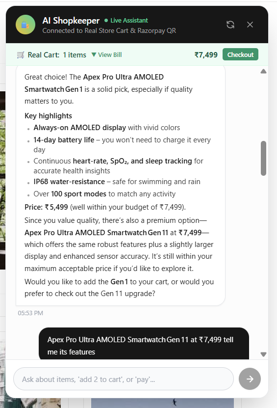
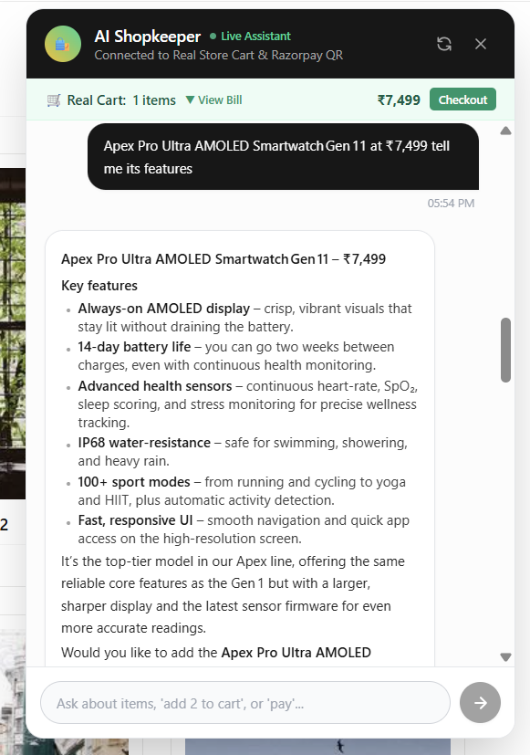
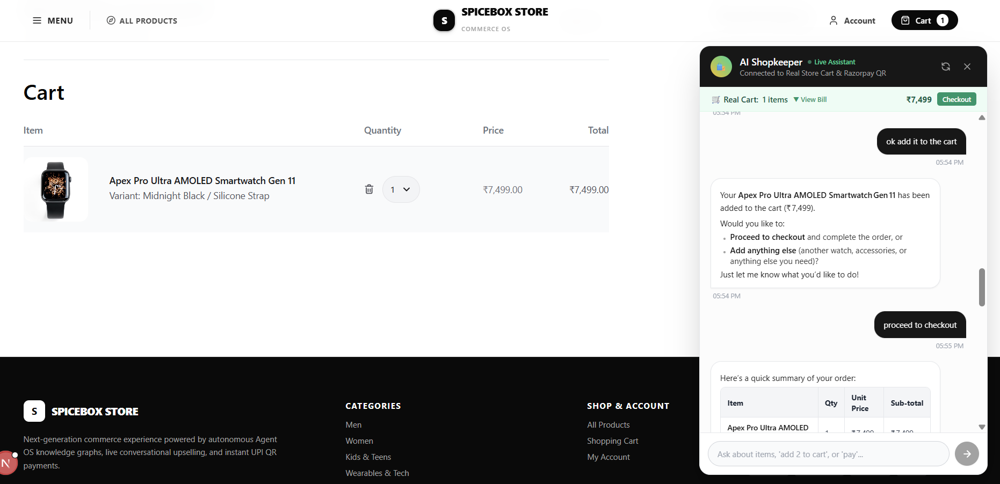
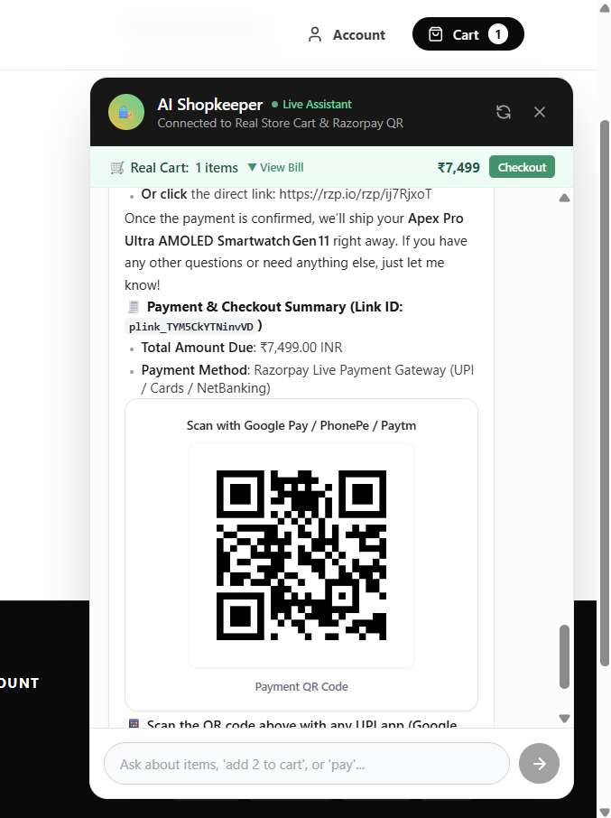
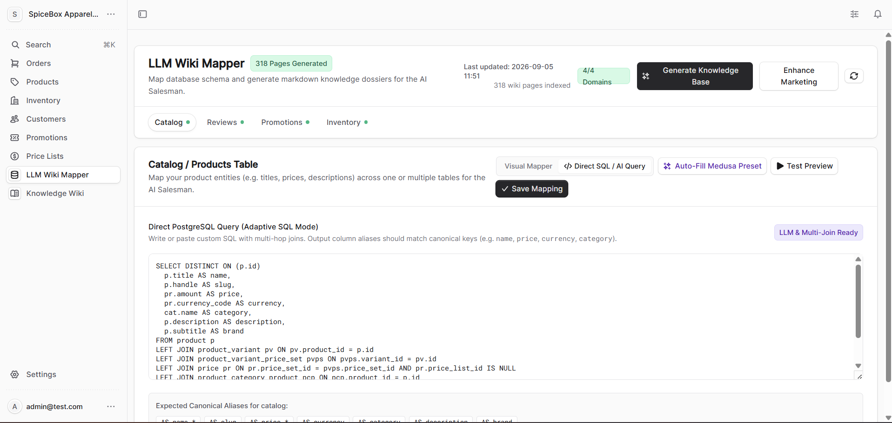
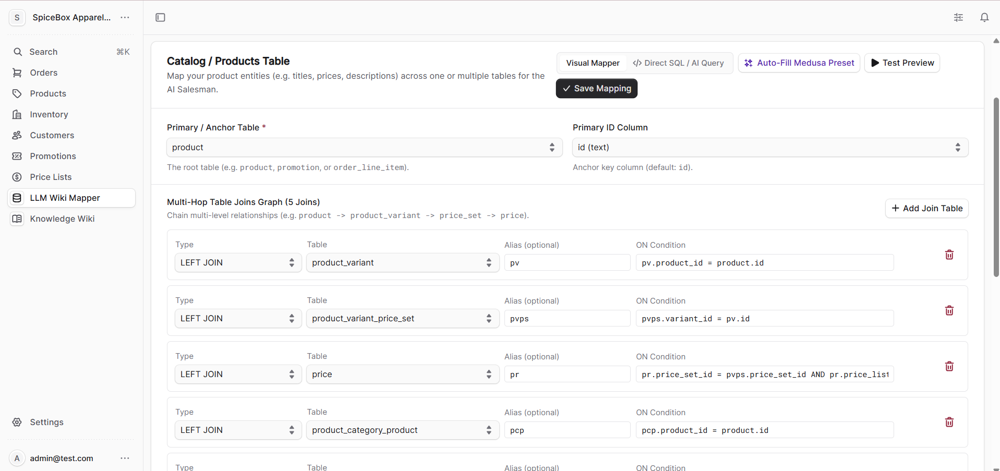
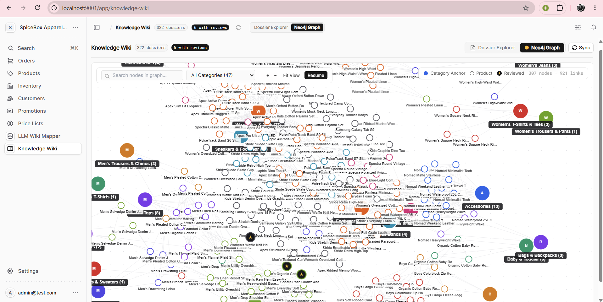
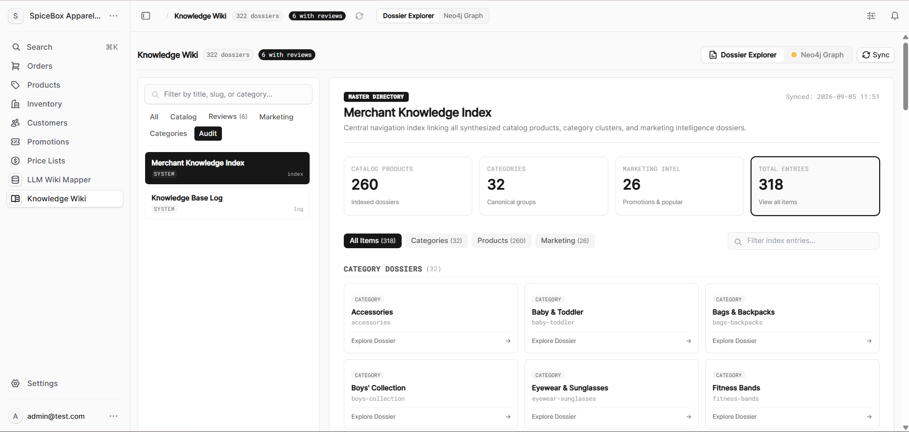

# 📦 SpiceBox Agent OS
### Autonomous AI Commerce & Growth Engine — Powered by LangGraph, Medusa & Razorpay

[](https://razorpay.com)
[](https://langchain-ai.github.io/langgraph/)
[](https://python.org)
[](https://medusajs.com)
[](https://razorpay.com/docs/api/)
[](LICENSE)

> **"Every financial action explainable, bounded, and gated. Complete audit trail with zero ungrounded transactions."**

---

<p align="center">
  
</p>

### ⚡ What is SpiceBox Agent OS in 60 Seconds?

**SpiceBox Agent OS** is a production-grade agentic commerce platform built for **Razorpay Buildathon Track 01: "AI Growth & Agentic Commerce"**. 

Traditional e-commerce chatbots are ungrounded conversational toys: they hallucinate inventory, push irrelevant products, cannot manage real store carts, and trigger blind payments without customer shipping addresses. 

**SpiceBox Agent OS replaces this with an autonomous two-agent architecture:**
1. **Agent 1: Offline Knowledge Graph Manager (`store_manager_llm`)** — An autonomous ETL engine embedded in Medusa Admin that maps relational PostgreSQL tables and customer reviews into a 300+ node semantic Knowledge Graph and markdown dossier wiki.
2. **Agent 2: Online Merchant Commerce Agent (`merchant_llm`)** — A warm, empathetic AI salesman that conducts grounded sales discovery, enforces deterministic mathematical upsell scoring ($0-100$), synchronizes bidirectionally with the real Next.js storefront cart, and generates **gated, address-verified Razorpay live UPI QR codes** directly inside chat.

---

## 🎬 Visual Feature Tour

Explore how SpiceBox Agent OS guides customers seamlessly from conversational intent to payment verification.

### 1. Conversational Discovery & Mathematical Upselling

<p align="center">
  
  
  
</p>

* **Grounded Natural Discovery**: When the customer asks for smartwatches, the agent lists real catalog options with verified specs and INR prices from the Knowledge Wiki.
* **Intent-Aware Soft Upselling**: The intent analyzer extracts quality orientation from customer phrases (*"quality is important"*) and calculates a policy score. Instead of pushy sales tactics, it gently presents a premium upgrade within budget.
* **Granular Specs on Demand**: Cites battery life, AMOLED display specs, and sensor details directly from indexed markdown product dossiers.

---

### 2. Real-Time Storefront Cart Sync & Address-Gated Razorpay QR

<p align="center">
  
  
</p>

* **Bidirectional Medusa Cart Synchronization**: When the customer types *"ok add it to the cart"*, the AI invokes the `add_to_cart` tool. The Next.js storefront UI instantly updates the cart badge and line items in real time.
* **Strict Address-First Gating**: The agent will **never** generate a payment link until complete delivery details (Name, Address, City, PIN Code, Phone, Email) are validated.
* **Instant Razorpay UPI QR Code**: Once delivery details are saved, the agent generates an official Razorpay payment link (`plink_...`) and renders a scannable dynamic UPI QR code natively inside the chat interface for instant payment via Google Pay, PhonePe, or Paytm.

---

### 3. Medusa Admin: LLM Wiki Mapper & Interactive Knowledge Graph

<p align="center">
  
  
</p>

* **Adaptive SQL & Multi-Hop Joins**: Ingests relational SQL tables (`product`, `variant`, `price_set`, `category`, `reviews`) through custom joins or automated Medusa presets.
* **Continuous Entity Normalization**: Resolves contradictory specs across data feeds with automated LLM conflict resolution and audit logging.

<p align="center">
  
  
</p>

* **Master Knowledge Directory**: Automatically organizes 318+ synthesized dossiers across Products (260), Categories (32), and Marketing Intelligence (26).
* **Interactive Neo4j Topology**: Explores 307 nodes and 921 semantic relationships (`BELONGS_TO`, `ALTERNATIVE_TO`, `COMPLEMENTS`) directly inside the Medusa Admin dashboard.

---

## 📑 Table of Contents

- [The Problem vs. Our Solution](#the-problem-vs-our-solution)
- [System Architecture](#system-architecture)
- [The Two-Agent Engine](#the-two-agent-engine)
  - [Agent 1: Knowledge Graph Manager](#1-agent-1-knowledge-graph-manager-store_manager_llm)
  - [Agent 2: Merchant Commerce Agent](#2-agent-2-merchant-commerce-agent-merchant_llm)
- [Mathematical Upsell & Policy Engine](#mathematical-upsell--policy-engine)
- [Safety, Gating & Financial Guardrails](#safety-gating--financial-guardrails)
- [Razorpay Test-Mode Integration](#razorpay-test-mode-integration)
- [Audit Trail & Observability](#audit-trail--observability)
- [Failure Handling & Resilience](#failure-handling--resilience)
- [Repository Structure](#repository-structure)
- [Getting Started & Local Setup](#getting-started--local-setup)
- [API Reference](#api-reference)
- [Verification & Automated Tests](#verification--automated-tests)

---

## The Problem vs. Our Solution

| Challenge | Traditional Chatbots | SpiceBox Agent OS |
|---|---|---|
| **Catalog Grounding** | Prompts hallucinate prices, specs, and out-of-stock items. | Grounded in an offline, verified Markdown Wiki with YAML frontmatter & RapidFuzz matching. |
| **Sales Decisions** | Aggressive or random upselling that causes customer churn. | Deterministic scoring algorithm ($0$ to $100$) with a hard budget firewall (`NO_UPSELL`). |
| **Cart & Pricing** | LLM invents order totals or discounts in plain text. | Cart line items $\sum (P \times Q)$ computed deterministically by Python cart state. |
| **Payment Safety** | Triggers payment links prematurely without delivery details. | **Address-First Gating**: Hard block on payment creation until shipping address is validated. |
| **Checkout UX** | Redirects customer out of chat to complex external forms. | Generates official Razorpay payment links (`plink_...`) with embedded in-chat UPI QR codes. |
| **Auditability** | Ephemeral, unlogged prompt completions. | Every ingest, conflict resolution, intent score, and payment link ID is permanently logged to `log.md`. |

---

## System Architecture

```
+-----------------------------------------------------------------------------------+
|                                  SPICEBOX AGENT OS                                |
+-----------------------------------------------------------------------------------+
                                          │
     ┌────────────────────────────────────┴────────────────────────────────────┐
     │                                                                         │
     ▼                                                                         ▼
┌────────────────────────────────────┐               ┌─────────────────────────────────────┐
│ AGENT 1: KNOWLEDGE GRAPH MANAGER   │               │ AGENT 2: MERCHANT COMMERCE AGENT    │
│ (knowledge_grap_manager_llm)       │               │ (merchant_llm)                      │
│                                    │               │                                     │
│ 1. collect_data (Medusa / Postgres)│               │ 1. selling_context_node             │
│ 2. extract_entities & reviews      │               │    - Intent Analyzer Subgraph       │
│ 3. knowledge_diff & create_pages   │               │    - RapidFuzz Wiki Retrieval       │
│ 4. resolve_conflict (LLM Analyst)  │               │    - Deterministic policy.py        │
│ 5. cross_reference (Wiki Graph)    │               │ 2. merchant_llm_node                │
│ 6. update_index & append_log       │               │    - Multi-Model Fallback Chain     │
│ 7. validate_wiki (Health Lint)     │               │    - schema.md Constitution         │
└─────────────────┬──────────────────┘               └──────────────────┬──────────────────┘
                  │                                                     │
                  ▼ Writes Markdown                                     ▼ Calls 10 Tools
┌────────────────────────────────────┐               ┌─────────────────────────────────────┐
│ PERSISTENT KNOWLEDGE WIKI          │◄──────────────┤ COMMERCE & CART TOOLS               │
│ ├── wiki/knowledge/products/*.md   │  Reads        │ - get_product_catalog / upsell      │
│ ├── wiki/knowledge/categories/*.md │  Catalog      │ - add_to_cart / remove / clear      │
│ ├── wiki/marketing/popular/*.md    │               │ - set_shipping_address              │
│ └── wiki/log.md (Audit Trail)      │               └──────────────────┬──────────────────┘
└────────────────────────────────────┘                                  │
                                                                        ▼
                                                     ┌─────────────────────────────────────┐
                                                     │ FINANCIAL GATING LAYER (cart.py)    │
                                                     │ [Gate 1: shipping_address present?] │
                                                     │ [Gate 2: amount = cart.total > 0]   │
                                                     └──────────────────┬──────────────────┘
                                                                        │
                                                                        ▼
                                                     ┌─────────────────────────────────────┐
                                                     │ RAZORPAY TEST API INTEGRATION       │
                                                     │ - client.payment_link.create()      │
                                                     │ - In-Memory Base64 UPI QR Generator │
                                                     │ - Output: plink_... & Short URL     │
                                                     └─────────────────────────────────────┘
```

---

## The Two-Agent Engine

### 1. Agent 1: Knowledge Graph Manager (`store_manager_llm`)
- **Core Role**: Autonomous ETL & Knowledge Graph Maintainer.
- **Input**: Database records via Medusa Admin API or direct PostgreSQL connection.
- **LangGraph Pipeline (12 Nodes)**:
  1. `collect_data`: Ingests catalog datasets and customer reviews.
  2. `extract_entities`: Normalizes SKUs, pricing, specifications, and variants.
  3. `extract_reviews`: Synthesizes ratings, top pros, top cons, and sentiment summaries.
  4. `search_existing_wiki`: Scans existing markdown dossiers for incremental diffing.
  5. `knowledge_diff`: Identifies what needs creation vs. updating.
  6. `create_pages` / `update_pages`: Compiles structured markdown with YAML frontmatter via Jinja2 templates.
  7. `resolve_conflict`: Resolves contradictory specifications between sources using LLM reasoning.
  8. `cross_reference`: Generates bidirectional graph links (`BELONGS_TO`, `ALTERNATIVE_TO`, brand accessories).
  9. `update_index`: Compiles master catalog directories.
  10. `append_log`: Writes structured transaction audits to `log.md`.
  11. `validate_wiki`: Runs health linting (checking orphan pages, broken links, conflicting specs, health score %).

### 2. Agent 2: Merchant Commerce Agent (`merchant_llm`)
- **Core Role**: Autonomous Conversational Commerce & Checkout Agent.
- **Multi-Model Fallback Chain**:
  - **Primary**: Local Ollama (`gpt-oss:120b-cloud`, `gpt-oss:20b-cloud`) — Zero TPM/TPD limits.
  - **Secondary**: Groq Cloud (`openai/gpt-oss-20b`, `openai/gpt-oss-120b`, `qwen/qwen3.6-27b`, `qwen/qwen3.8-27b`).
- **Tools Bound (10 Tools)**:
  `get_product_catalog`, `get_better_alternatives`, `get_upsell_products`, `add_to_cart`, `get_cart`, `remove_from_cart`, `clear_cart`, `set_shipping_address`, `generate_payment_qr`, `show_receipt_image`.

---

## Mathematical Upsell & Policy Engine

In `intent_analyzer_llm/policy.py`, **no LLM is permitted to make an arbitrary sales or pricing decision**. All decisions are governed by transparent, explainable formulas:

### 1. Upsell Opportunity Score (0 – 100)
$$\text{Score} = 100 \times \left( 0.45 \cdot \text{openness} + 0.30 \cdot \text{quality} + 0.25 \cdot (1 - \text{restrictiveness}) \right)$$

### 2. Policy Decision Thresholds
- $\text{Score} < 30$ **OR** Hard Budget Refusal $\longrightarrow$ **`NO_UPSELL`** *(Strict ban on higher-priced items)*
- $30 \le \text{Score} < 60$ $\longrightarrow$ **`SOFT_UPSELL`** *(Gentle upgrade mention)*
- $\text{Score} \ge 60$ $\longrightarrow$ **`ACTIVE_UPSELL`** *(Confident value upgrade)*

### 3. Maximum Acceptable Price Boundary
$$\text{Effective Budget} = \begin{cases} \text{Stated Budget} & \text{if hard budget constraint} \\ \text{Stated Budget} \times (1 + \text{Acceptable Stretch}) & \text{otherwise} \end{cases}$$

Candidate selection (`select_upsell_candidate`) strictly filters out any item exceeding `Effective Budget`.

---

## Safety, Gating & Financial Guardrails

To meet the strictest hackathon criteria, we enforce non-negotiable execution boundaries:

1. **Mandatory Address-First Checkout Gating**:
   ```python
   # tools.py lines 124-130
   cart_data = get_cart_data()
   if not cart_data.get("shipping_address"):
       return "Cannot generate payment QR code yet: Customer's delivery/shipping address is missing. Ask for shipping details FIRST."
   ```
2. **Deterministic Amount Calculation**:
   The LLM cannot invent or alter payment amounts. If `amount_inr <= 0` or arbitrary, `create_payment_qr` forces:
   $$\text{amount} = \sum (\text{item.price} \times \text{item.quantity})$$
3. **Hard Budget Constraint Firewall**:
   Regex detection (`_HARD_BUDGET`) catches phrases like *"not a single rupee more"* or *"strictly under 5000"*, instantly locking `hard_budget_constraint = True`, forcing `NO_UPSELL`, and blocking upsell recommendations.
4. **Question Discipline**:
   Clarification questions across the session are tracked and capped at **3 total** (excluding pure greetings) to prevent customer fatigue.
5. **Cross-Sell Discipline**:
   Complementary accessories are suppressed until the customer explicitly selects or confirms a primary product (`primary_selected == True`).
6. **Policy Privacy Enforcement**:
   The agent is strictly forbidden from leaking internal system terminology (such as *"policy"*, *"soft-upsell"*, or *"intent signals"*) in customer chat, preserving the authentic feel of a personal shopkeeper.

---

## Razorpay Test-Mode Integration

The payment pipeline runs through Razorpay's official Python SDK:

```python
import razorpay

client = razorpay.Client(auth=(RAZORPAY_KEY_ID, RAZORPAY_KEY_SECRET))
link = client.payment_link.create({
    "amount": int(amount_inr * 100),  # Amount in paise
    "currency": "INR",
    "accept_partial": False,
    "description": description,
    "customer": {
        "name": f"{first_name} {last_name}",
        "contact": phone,
        "email": email
    },
    "notify": {"sms": False, "email": False}
})
```

- **In-Chat UPI QR Code**: The returned `short_url` is converted in-memory to a PNG QR code via Python `qrcode`, encoded as a `data:image/png;base64,...` URL, and rendered directly in chat.
- **Universal Payability**: Customers can scan with Google Pay, PhonePe, Paytm, or click the direct Razorpay payment link.

---

## Audit Trail & Observability

Every action is traceable and reproducible:
1. **Ingest Operations Log (`wiki/log.md`)**:
   Maintains a persistent ledger of all dataset updates, pages created/updated, spec conflicts, and health check scores.
2. **Intent Analysis Logs**:
   Every turn logs structured JSON:
   `intent_analysis={"customer_need": ..., "budget": 5000, "score": 71.25, "decision": "ACTIVE_UPSELL"}`.
3. **Cart & Payment Action Ledger (`last_actions`)**:
   Tracks the exact Razorpay `payment_link_id` (e.g. `plink_TY7mUIeJeGP9Qm`), amount in INR, and delivery address.

---

## Failure Handling & Resilience

The codebase supports end-to-end graceful degradation:
- **Missing Address Attempt**: Gating layer rejects payment generation, displays an itemized bill, and guides the customer to provide shipping details.
- **Razorpay API Outage**: If Razorpay test credentials or network fail, `create_payment_qr` catches the exception and falls back to a standard NPCI UPI deep link (`upi://pay?pa=store@razorpay...`), ensuring the customer is never stranded.
- **LLM Rate Limits / Outages**: LangChain `.with_fallbacks()` automatically routes requests from Ollama to Groq models without dropping the chat session.
- **Data Source Unavailability**: If Medusa Admin HTTP API is unreachable, `collect_data` falls back to direct PostgreSQL queries via `psycopg2`.

---

## Repository Structure

```text
SpiceBox-Agent-OS/
├── backend/
│   ├── server.py                                    # HTTP runner (port 8002) for chat & wiki APIs
│   ├── merchant_knowledge/                          # Persistent AI-Readable Knowledge Wiki
│   │   └── wiki/
│   │       ├── index.md                             # Master catalog directory
│   │       ├── log.md                               # Operational audit trail
│   │       ├── knowledge/products/*.md              # Product dossiers with YAML frontmatter
│   │       ├── knowledge/categories/*.md            # Category dossiers
│   │       └── marketing/popular/*.md               # Marketing intelligence dossiers
│   └── src/agents/
│       ├── knowledge_grap_manager_llm/              # Agent 1: Wiki ETL & Maintenance
│       │   ├── graph.py                             # 12-Node LangGraph definition
│       │   ├── query_pipeline.py                    # RapidFuzz catalog search & retrieval
│       │   └── nodes/                               # collect, extract, diff, conflict, validate
│       ├── intent_analyzer_llm/                     # Intent & Policy Subgraph
│       │   ├── analyzer.py                          # CustomerIntent extraction
│       │   └── policy.py                            # Deterministic upsell scoring & boundaries
│       └── merchant_llm/                            # Agent 2: Conversational Commerce
│           ├── graph.py                             # Merchant LangGraph StateGraph
│           ├── schema.md                            # System constitution & behavioral rules
│           ├── nodes/                               # merchant_llm, selling_context, tools
│           └── utils/
│               ├── cart.py                          # In-memory cart, address & Razorpay QR
│               └── llm.py                           # Multi-model fallback chain (Ollama/Groq)
├── my-shop/                                         # Medusa DTC Monorepo (Backend & Storefront)
│   ├── apps/backend/                                # Medusa v2 Node.js Core & Admin UI
│   └── apps/storefront/                             # Next.js Storefront with AI Chat Drawer
└── readme_img/                                      # High-resolution screenshots & UI walkthroughs
```

---

## Getting Started & Local Setup

### Option A: Complete Docker Compose Stack (Recommended)

```bash
cd SpiceBox-Agent-OS/my-shop
docker compose up -d
```

Services started:
* **Next.js Storefront**: `http://localhost:8001`
* **Medusa Backend & Admin Dashboard**: `http://localhost:9001` (Admin: `http://localhost:9001/app`)
* **SpiceBox Agent OS Runner**: `http://localhost:8002`
* **PostgreSQL (Port 5433)** & **Redis (Port 6380)**

---

### Option B: Local Development Setup

#### 1. Backend Installation
```bash
cd SpiceBox-Agent-OS/backend
python -m venv venv
.\venv\Scripts\Activate.ps1   # On Windows (or source venv/bin/activate on Linux/Mac)
pip install -r requirement.txt
```

#### 2. Environment Configuration (`backend/.env`)
```ini
GROQ_API_KEY=gsk_your_groq_key
RAZORPAY_KEY_ID=rzp_test_your_key_id
RAZORPAY_KEY_SECRET=your_key_secret
OLLAMA_BASE_URL=http://localhost:11434
WIKI_SERVER_PORT=8002
MEDUSA_URL=http://localhost:9001
```

#### 3. Build Knowledge Wiki (Agent 1)
```bash
# Ingest catalog & marketing data into markdown wiki
python -m src.agents.store_manager_llm --source ./test_data --wiki ./merchant_knowledge --both
```

#### 4. Start Merchant Runner Server (Agent 2)
```bash
python server.py
# Server starts at http://0.0.0.0:8002
```

---

## API Reference

### `POST /chat` — Commerce Agent Endpoint
Processes customer conversation, performs intent analysis, and executes cart/checkout actions.

**Request Payload:**
```json
{
  "merchant_id": "default_merchant",
  "user_id": "cust_12345",
  "messages": [
    {"role": "user", "content": "I want a durable sports watch under ₹5000"}
  ],
  "cart": {"items": [], "shipping_address": null}
}
```

**Response Payload:**
```json
{
  "success": true,
  "response": "Here are our top sports watches under ₹5,000...",
  "cart": {
    "items": [],
    "total": 0.0,
    "item_count": 0,
    "shipping_address": null
  },
  "actions": []
}
```

### Additional Endpoints:
- `GET /wiki/tree`: Returns hierarchical tree of all catalog markdown pages.
- `GET /wiki/graph`: Returns Neo4j-compatible graph nodes & links (`BELONGS_TO`, `ALTERNATIVE_TO`).
- `POST /generate`: Triggers background execution of Agent 1 to rebuild/diff the wiki.
- `GET /status`: Live progress tracking of wiki generation.

---

## Verification & Automated Tests

Run the test suite to verify end-to-end commerce flows, intent analysis, and policy gating:

```bash
cd SpiceBox-Agent-OS/backend

# Verify Intent Analyzer & 10 Edge Cases
python -m pytest src/agents/intent_analyzer_llm/test/test_10_cases.py -v

# Verify Policy Engine
python -m pytest src/agents/intent_analyzer_llm/test/test_policy.py -v

# Run End-to-End Merchant Agent Simulation
python src/agents/merchant_llm/test/test_merchant_agent.py
```

---

## Contributors & Acknowledgements
Built for **Razorpay Buildathon Track 01**.
Special thanks to the **Razorpay Developer Platform**, **LangChain/LangGraph**, and **MedusaJS** communities.
